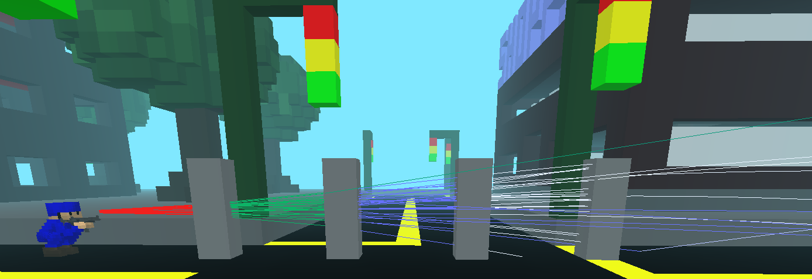

# Installation

1. Install [rzrn/horseradish](https://github.com/rzrn/horseradish). [piqueserver/piqueserver](https://github.com/piqueserver/piqueserver) is **not** supported anymore. This fork contains some important modifications, thus, do not expect scripts to work well without them.
2. Build C++ libraries with `make release`. You need GNU Make and a C++23‐conforming compiler for this (GCC 11+ or clang 13+). You may need to specifiy a path to `python3-config` binary and/or `pyspades` library manually with `make PYTHONCONFIG=/.../python3-config LIBPYSPADES=/.../pyspades/ release`.
3. Add `milsim` script as the first script to your `config.toml` (it is expected to be placed to the root of this repository). You may find additional scripts in directories `milsim/` and `scripts/`. To add a file `milsim/XXX.py` write `"milsim.XXX"` to your `config.toml` and to add `scripts/YYY.py` write simply `"YYY"` to it. Most likely you need to add at least `milsim.control`.

So your scripts list may look like this:
```
scripts = [
  "milsim",
  "bantools",
  "milsim.control",
  "milsim.explosive",
  "toolbox"
]
```

# FAQ

### Weapons are too dangerous! One shot kills instantly

That’s how it should be: use cover.

### Someone is shooting through walls!

This is intended. Some materials are not strong enough to stop bullet completely at all firing angles.

Note that **shooting-through-walls hacks are not possible** (unlike vanilla AoS) due to the simulator architecture.

### Can I shoot through the fog?

Yes, although it’s not that easy.

### Grenade is too dangerous!

1. Don’t run in circles around grenades.
2. Take cover immediately if you see or hear a grenade.

### Bleeding is annoying

Try not to run around in front of everyone. After all, use *your shovel:* dig tunnels and trenches.

### Mines are annoying

1. Be careful.
2. Don’t go straight into areas where there are likely to be a lot of mines (e.g. intel, narrow tunnels, doors, back entrances, places convenient for sniper fire etc).
3. Deactivate mines with a grenade explosion.
4. Cooperate in your team and report the location of placed mines in the team chat.

### I don’t see/hear drones

1. Unfortunately, there are protocol restrictions prohibiting any custom models.
2. In fact, this is *not that far* from reality, because modern weapons are **much more** louder than a typical drone.
3. Don’t stay outdoors for a long time (especially if you are a sniper).

### Airstrikes are too loud

Yes they are.

### Airstrikes are useless and too inaccurate

1. No they aren’t.
2. Check your minimap carefully: airstrike will follow direction of the player who called it.

### It’s too hard/realistic! It’s not fun!

Go play babel.

### It’s too unrealistic! AoS cannot be / isn’t meant to be an ARMA!

Go play ARMA + [ACE3](https://github.com/acemod/ACE3).

### ACE3 is still too unrealistic

Go to a shooting range, airsoft club or army.

(Not to mention that real war is not fun at all.)

# Protocol extensions

For the reference implementations of these extensions see [TigerSpades](https://github.com/rzrn/tigerspades).

## Bullet traces

Extension ID: 0x10.

| Field name | Field type  | Notes                                                                           |
|------------|-------------|---------------------------------------------------------------------------------|
| index      | UByte       | Strictly increasing (in the current implementation) identifier of a projectile. |
| position   | LE Float[3] | Current position.                                                               |
| value      | LE Float    | Current speed divided by the initial speed.                                     |
| origin     | UByte       | Whether this is the first packet for this identifier.                           |

## Hit effects

Extension ID: 0x11.

Sent whenever projectile hits a target to provide better visual response.

| Field name | Field type  | Notes        |
|------------|-------------|--------------|
| position   | LE Float[3] | Hit position |
| block      | LE Int[3]   | Hit block    |
| target     | UByte       | *See below*  |

| Target | Description |
|--------|-------------|
| 0      | Block       |
| 1      | Headshot    |
| 2      | Player      |

# Third-party resources

The [OktoberDistrict](maps/OktoberDistrict.vxl) map by Bubochka.

# References

* [Under the hood: the physics of projectile ballistics](http://panoptesv.com/RPGs/Equipment/Weapons/Projectile_physics.php).
* [Towards a better, science-based, evaluation of kinetic non-lethal weapons](https://www.researchgate.net/publication/254911398_Towards_a_better_science-based_evaluation_of_kinetic_non-lethal_weapons), L. Koene, A. Papy.
* [Terminal Ballistics](https://link.springer.com/book/10.1007/978-3-030-46612-1), 3rd edition, Z. Rosenberg, E. Dekel.
* [Grammatical Framework’s Resource Grammar Library (RGL)](https://github.com/GrammaticalFramework/gf-rgl).
* [Basic English Grammar and Sentence Structures](https://www.scientificpsychic.com/grammar/enggram1.html).
* [Speech and Language Processing: An Introduction to Speech Recognition, Computational Linguistics and Natural Language Processing](https://web.stanford.edu/~jurafsky/slp3/), 2nd edition, D. Jurafsky, J. H. Martin.
* [The Solid Angle of a Plane Triangle](https://ieeexplore.ieee.org/document/4121581), A. van Oosterom, J. Strackee.
* [Estimate of Man’s Tolerance to the Direct Effects of Air Blast](https://apps.dtic.mil/sti/tr/pdf/AD0693105.pdf), I. G. Bowen, E. R. Fletcher, D. R. Richmond.
* [A survey of computational models for blast induced human injuries for security and defence applications](https://publications.jrc.ec.europa.eu/repository/bitstream/JRC119310/00surveyprobits_final-1.pdf), G. Solomos, M. Larcher, G. Valsamos, V. Karlos, F. Casadei.
* [Explosive Shocks in Air](https://link.springer.com/book/10.1007/978-3-642-86682-1), G. F. Kinney, K. J. Graham.
* [Dynamic Behavior of Materials](https://onlinelibrary.wiley.com/doi/book/10.1002/9780470172278), M. A. Meyers.

# See also

* [Arma: Cold War Assault Remastered Source Code Repository](https://github.com/BohemiaInteractive/CWR/): GPL-3.0-or-later version of the engine powering the original ‘Operation Flashpoint: Cold War Crisis’ game, which was later rereleased as ‘Arma: Cold War Assault’. Also check out [the community fork](https://github.com/ofpisnotdead-com/CWR-CE).
* [ACE3](https://github.com/acemod/ACE3): open-source realism mod for Arma 3.
* [ACE-Anvil](https://github.com/acemod/ACE-Anvil): an experimental realism mod for Arma Reforger, the first Arma game running on the Enfusion engine.

# License

Copyright © 2021–2026 rzrn

This program is free software: you can redistribute it and/or modify
it under the terms of the GNU Affero General Public License as published by
the Free Software Foundation, either version 3 of the License, or
(at your option) any later version.

This program is distributed in the hope that it will be useful,
but WITHOUT ANY WARRANTY; without even the implied warranty of
MERCHANTABILITY or FITNESS FOR A PARTICULAR PURPOSE. See the
GNU Affero General Public License for more details.

You should have received a copy of the GNU Affero General Public License
along with this program. If not, see <https://www.gnu.org/licenses/>.

Additionally, parts of this program are licensed under the GNU General Public License
as published by the Free Software Foundation, either version 3 of the License, or
(at your option) any later version. The terms of both licenses apply to the respective parts,
and the combination as a whole is subject to the conditions of both licenses.

You should have received a copy of the GNU General Public License
along with these parts. If not, see <https://www.gnu.org/licenses/>.

The file `extra/anyascii/anyascii.tsv` is taken from [AnyAscii](https://github.com/anyascii/anyascii)
project under the ISC License.