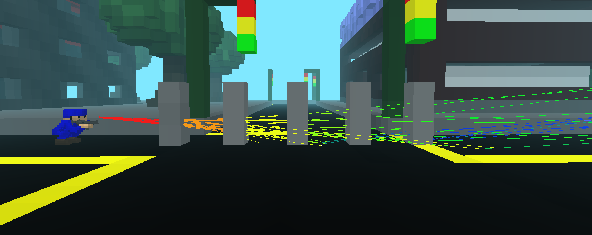

# FAQ

### Weapons are too dangerous! One shot kills instantly

That’s how it should be: use cover.

### Someone is shooting through walls!

This is intended. Some materials are not strong enough to stop bullet completely at all firing angles.

Note that **shooting-through-walls hacks are not possible** (unlike vanilla AoS) due to the simulator architecture.

### Grenade is too dangerous!

1. Don’t run in circles around grenades.
2. Take cover immediately if you see or hear a grenade.

### Bleeding is annoying

Try not to run around in front of everyone. After all, use *your shovel:* dig tunnels and trenches.

### Mines are annoying

1. Be careful.
2. Don’t go straight into areas where there are likely to be a lot of mines (e.g. intel, narrow tunnels, doors, back entrances, places convenient for sniper fire etc).
3. Deactivate mines with a greande explosion.
4. Cooperate in your team and report the location of placed mines in the team chat.

### I don’t see/hear drones

1. Unfortunately, there are protocol restrictions prohibiting any custom models.
2. In fact, this is *not that far* from reality, because modern weapons are **much more** louder than a typical drone.
3. Don’t stay outdoors for a long time (especially if you are a sniper).

### Airstrikes are too loud

Yes they are.

### Airstrikes are useless and too inaccurate

1. No they aren’t.
2. Check your minimap carefully: airstrike will follow direction of the player who called it.

### It’s too hard/realistic! It’s not fun!

Go play babel.

### It’s too unrealistic! AoS cannot be / isn’t meant to be an ARMA!

Go play ARMA + [ACE3](https://github.com/acemod/ACE3).

### ACE3 is still too unrealistic

Go to a shooting range, airsoft club or army.

(Not to mention that real war is not fun at all.)